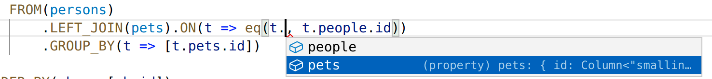
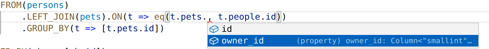

# ivory-tower

Typed psql querys in typescript. Writing pure sql, one can easily find oneself in situation, where the query is not valid. This library aims to help query building, so the resulting query is correct. The query is written in similar fashion as in sql, the aim of the project is to make the javascript expression look as similar as possible to the sql query with regards to the limits of javascript language.

In order to do that, during query construction, we have to track these things:
* sql abstract syntax tree, that we will use to print to sql and send this query to the running database instance
* type definition of the expression, basically a row of columns including the names of the columns
* transformers, that will convert data from psql format to javascript format

## Features

### select

Consider this sql query:
```
SELECT people.name FROM people
```
This query is represented by this javascript expression:
```
SELECT(t => [t.people.name], FROM(persons))
```

In the above query, if we would write the query by raw sql string, we could make a mistake of selecting different columns than those, that are defined in the persons table. Therefore, the `t.people` object contains only fields defined in the persons table. Would we try to access some column that is not defined in that table, we would get compile error.

### joins

```
    SELECT((t) => [t.pets.id],
        FROM(persons)
            .LEFT_JOIN(pets).ON(t => eq(t.pets.owner_id, t.people.id))
    )
```

Similarly, in the join, I only want to join field of the same type and I want to make sure, that I'm only picking the columns from tables, that are joined together.

VScode recognizes, that I can only select from the two tables


VScode knows, that I can only select from columns defined in the respective table


## running example

```
yarn
docker-compose up
yarn run example
```

## running tests
```
yarn test
```
